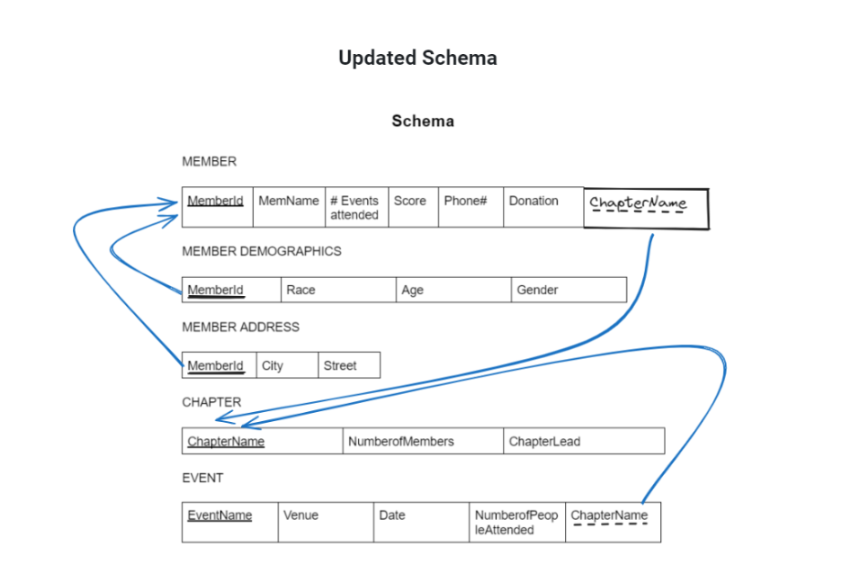

# Domain Names

# MEMBER
| Attribute       | Domain Name  | Description                                 | Domain                        |
|-----------------|--------------|---------------------------------------------|-------------------------------|
| MemberID | Member IDs | This variable is going to store distinct member IDs. the IDs will automatically increment as a new member is added. | Serial size 10 |
| Score | Scores | The score is calculated based on members’ attendance. Every time a member attends an event they get one point. Since the score represents the number of events attended, it would take any value between zero to infinity. | integer: 3 digits |
| Phone # | Phone Numbers | This variable stores members’ phone numbers. | integer: 10 digits |
| MemberName | Names | Stores the first and last name of each member in a chapter | character: size 25 |
| Address | Addresses | The address stores member addresses. The values are going to be a string containing street number, street name, city and zip code. | Character: size 250 |
| Donation | Donations | This variable stores the donation. A donation can be monetary or non-monetary. | character: size 25 |
# CHAPTER
| Attribute       | Domain Name  | Description                                 | Domain                        |
|-----------------|--------------|---------------------------------------------|-------------------------------|
| ChapterName | Names | It stores the name of the chapter and serves as a primary key for the member table. | character: size 25 |
| NumberofMembers | Numbers | This stores the total number of events a member attended. | integer: 4 digits |
| ChapterLead | Names | This attribute stores the name of the chapter-lead for a particular chapter. | character: 25 |
# EVENT
| Attribute       | Domain Name  | Description                                 | Domain                        |
|-----------------|--------------|---------------------------------------------|-------------------------------|
| EventName | Names | This stores the name of a particular event. | character: size 25 |
| Venue | Locations | This stores the location where an event occurred. | character: 30 |
| EventDate | Dates | This stores the date an event takes place. | date: format mm/dd/yy |
| NumberOfPeopleAttended | Numbers | This stores the total count of the people who attended an event. | integer: 3 digits |

# Schema

# Reflections & Changes
- Our previous version was missing a domain for each entity type. 
- We created a table for each entity type where we detailed the attribute name, description, and domain (type and size limit) for each attribute of the entity.
- We also identified all multivalued attributes among the attributes of each entity type and restructured our E-R Diagram and Schema Design accordingly. 
- All spelling errors were also corrected.

