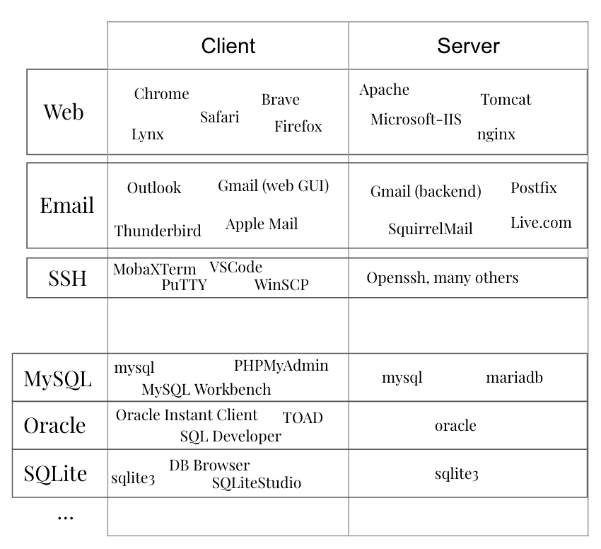
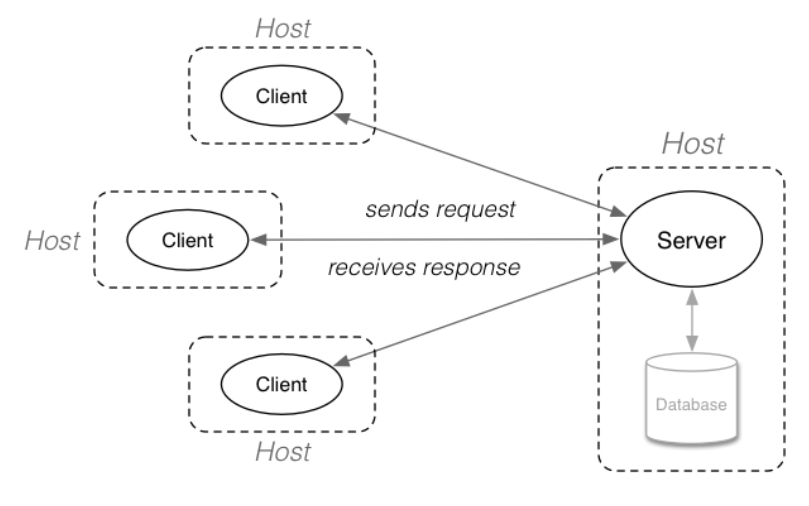
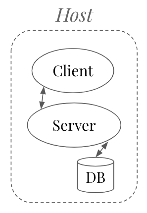

# Work in Progress

# Web Basics

This repository contains a basic web app written in Python using the Flask framework and a PostgreSQL database. The purpose is to provide a simple, working application that can be examined and edited by someone who is learning the basics of web development. The application can be run using GitHub Codespaces, so no local environment setup is necessary.

To skip to the exercises without reading the rest of this document (are you sure?), go [here](EXERCISES.md).

## Client / Server Architecture

Most networked applications follow a client/server architecture at some level, where multiple client applications communicate using a specific protocol with one or more server applications. The web browser is the most obvious everyday example, with multiple client browsers (e.g., Chrome, Firefox, Edge, Safari) able to connect to many different web server implementations,  (e.g., Apache, nginx, Tomcat).

It is important to keep separate in your mind the client/server functionality distinction from a local/remote physical location distinction. Clients and Servers are separate from each other in the roles they fulfill in an application, not because of where they run. While the standard client/server diagram shows the clients communicating with servers over the internet or a remote network, they don't have to.

A system where client and server are operating on the same computer or virtual machine is a very common development paradigm. The following diagram is equally valid.

## Web Protocols
## Diagram

# Technologies
There are many different ways to put together a web application. This is what we are using:

## Python

To generate dynamic pages for the web server to send, we need a programming language. This one uses Python. There are many other options. Alternatives: Javascript, PHP, Perl, C#, Java, just about any other language. 

### Flask

Flask is a Python web framework. It includes all of the functionality necessary to help structure and generate a web application. It also includes a web server for ease of development. https://flask.palletsprojects.com/en/3.0.x/. Alternatives for Python: Twisted or Django

### Jinja

A templating language lets us re-use html and apply data from our controllers to our html views. It is interspersed throughout the HTML and feels a bit like Python, until you run into something that doesn't. Alternatives for Python: https://wiki.python.org/moin/Templating

## HTML

HTML (Hypertext Markup Language) is a markup language. It describes the __structure__ of our data for the browser (web client). The browser will render the page for the end user with default styling.

## CSS

CSS (Cascading Style Sheets) is used to __style__ our page. We declare style properties in classes that we can apply to our HTML. This lets us re-use styles across our application and provides flexibility. There are tools to add on to CSS (SASS, SCSS, LESS) for further functionality but we are not using them.

## Javascript

Javascript is used to control the __behavior__ of our page on the the client-side. This is usually used for validation, asynchronous requests to the web server, and improving the user interface. Some web applications are entirely written in javascript (e.g., React, Angular). Javascript can manipulate the structure of an html page, trigger browser and page events, and interact with the hardware that runs the browser.

## PostgreSQL

PostgreSQL is an open-source relational database management system (RDBMS).

# Application Description
## Model-View-Controller (MVC)
## File Layout

# Running the app
## With Codespace
## Without Codespace
### Requirements
### Environment
### Database

## Running Flask

# Troubleshooting
## 
## Database Access
